# Real-Time Routing Table Analysis using MCP Resources

## Course: Wireless Mobile Networks (WMN)
## Students: Harshavardhana B Undodi, Sumit Rathod, Anish Shetty and Shashank Bhagoji
## Date: May 2026

---

## 1. Abstract

This project implements a real-time routing table monitoring and analysis system
using the **Model Context Protocol (MCP)**. The system integrates with a Mininet-WiFi
network emulator to create a 4-router ring topology, exposes routing data through
standardized MCP Resources and Tools, and provides an interactive client for querying
and analyzing network routing behavior. The evaluation demonstrates sub-millisecond
tool response latencies and effective detection of route injection, link failure, and
routing anomalies across the emulated network.

---

## 2. Introduction

### 2.1 What is MCP (Model Context Protocol)?

The **Model Context Protocol (MCP)** is an open protocol developed to provide a
standardized way for applications to expose structured data (**Resources**) and
executable functions (**Tools**) to clients. MCP uses a client–server architecture
where servers publish capabilities via a discovery mechanism, and clients connect
to consume them. Communication can occur over stdio, HTTP/SSE, or WebSocket
transports.

Key MCP concepts:
- **Resources** — Read-only data endpoints identified by URIs (e.g., `routing://table/live`)
- **Tools** — Executable functions that clients can invoke with parameters
- **Transports** — Communication channels (stdio, HTTP, WebSocket)

### 2.2 Why Routing Table Analysis Matters

In wireless mobile networks, routing tables are dynamic and can change rapidly due to
node mobility, link quality variations, and topology changes. Real-time monitoring of
routing tables is essential for:

- **Detecting route instability** (route flaps) that degrade network performance
- **Identifying routing loops** that cause packet loss and increased latency
- **Analyzing convergence time** after topology changes
- **Optimizing path selection** in multi-path routing environments

### 2.3 Problem Statement

Traditional routing table monitoring relies on periodic manual inspection using
command-line tools like `ip route show`. This approach lacks:

1. Structured data access across multiple routers simultaneously
2. Historical tracking and comparison of routing states
3. Automated anomaly detection (flaps, loops)
4. A standardized API for tool integration

This project addresses these gaps by wrapping routing table data in the MCP protocol,
enabling real-time, programmatic access to routing information across a multi-router
topology.

---

## 3. System Architecture

### 3.1 Architecture Diagram

```
┌─────────────────────────────────────────────────────────────────────────┐
│                         SYSTEM ARCHITECTURE                            │
├─────────────────────────────────────────────────────────────────────────┤
│                                                                        │
│  ┌────────────────────┐   stdio    ┌───────────────────────────────┐   │
│  │    MCP Client       │◄─────────►│     MCP Server (FastMCP)      │   │
│  │  (mcp_client.py)    │           │    (mcp_server.py)            │   │
│  │                     │           │                               │   │
│  │  Interactive CLI:   │           │  Resources:                   │   │
│  │  • get routes       │           │  • routing://table/live       │   │
│  │  • get router r1    │           │  • routing://table/{router} │   │
│  │  • detect loops     │           │  • routing://table/history    │   │
│  │  • show topology    │           │  • routing://topology         │   │
│  │  • find path        │           │                               │   │
│  │  • show events      │           │  Tools:                       │   │
│  └────────────────────┘           │  • get_routing_table()        │   │
│                                    │  • get_router_table()         │   │
│                                    │  • detect_route_flap()        │   │
│                                    │  • detect_routing_loops()     │   │
│                                    │  • compare_snapshots()        │   │
│                                    │  • find_best_path()           │   │
│                                    │  • get_topology()             │   │
│                                    │  • get_route_events()         │   │
│                                    └──────────┬────────────────────┘   │
│                                               │                        │
│                                    ┌──────────▼────────────────────┐   │
│                                    │  Routing Poller               │   │
│                                    │  (routing_poller.py)          │   │
│                                    │                               │   │
│                                    │  Reads: routing_tables.json   │   │
│                                    │  Polls every 5 seconds        │   │
│                                    │  Falls back to ip route / mock│   │
│                                    └──────────┬────────────────────┘   │
│                                               │                        │
│                                    ┌──────────▼────────────────────┐   │
│                                    │  Mininet-WiFi Topology        │   │
│                                    │  (mininet_topology.py)        │   │
│                                    │                               │   │
│                                    │    r1 ──── r2                 │   │
│                                    │    |        |     Ring         │   │
│                                    │    r4 ──── r3   Topology      │   │
│                                    │                               │   │
│                                    │  Subnets: 10.0.1-4.0/24      │   │
│                                    └──────────────────────────────┘   │
│                                                                        │
└─────────────────────────────────────────────────────────────────────────┘
```

### 3.2 MCP Resources

| Resource URI                            | Description                                  |
|-----------------------------------------|----------------------------------------------|
| `routing://table/live`                  | Latest routing table snapshot (all routers)   |
| `routing://table/history/{timestamp}` | Historical snapshot by timestamp              |
| `routing://table/{router_id}`         | Routing table for a specific router (r1–r4)   |
| `routing://topology`                    | Full network topology graph                   |

### 3.3 MCP Tools

| Tool                            | Parameters            | Description                              |
|---------------------------------|-----------------------|------------------------------------------|
| `get_routing_table()`           | none                  | Returns all routes across all routers    |
| `get_router_table(router_id)`   | router_id: str        | Returns routes for a specific router     |
| `detect_route_flap()`           | none                  | Detects routes changing >3× in 60s       |
| `detect_routing_loops()`        | none                  | Checks for forwarding loops              |
| `compare_snapshots(ts1, ts2)`   | two timestamps        | Diffs two historical snapshots           |
| `find_best_path(destination)`   | destination prefix    | Finds lowest-metric next-hop             |
| `get_topology()`                | none                  | Returns network topology graph           |
| `get_route_events()`            | none                  | Returns recent route-change events       |

---

## 4. Implementation Details

### 4.1 Technology Stack

| Technology      | Version | Purpose                                       |
|-----------------|---------|-----------------------------------------------|
| Python          | 3.12    | Core programming language                     |
| FastMCP         | 3.3.1   | MCP server framework                          |
| MCP SDK         | 1.27    | MCP client library                            |
| Mininet-WiFi    | 2.7     | Network topology emulation                    |
| NetworkX        | 3.6     | Graph analysis and topology visualization     |
| Matplotlib      | 3.10    | Chart and graph generation                    |
| asyncio         | stdlib  | Asynchronous I/O for background polling       |
| psutil          | 7.0+    | CPU and memory usage measurement              |

### 4.2 Key Files

| File                          | Role                                              |
|-------------------------------|---------------------------------------------------|
| `server/mcp_server.py`        | FastMCP server with resources, tools, and poller   |
| `server/routing_poller.py`    | Multi-source routing data poller                   |
| `client/mcp_client.py`        | Interactive CLI client                             |
| `network/mininet_topology.py` | Mininet ring topology (4 routers)                  |
| `network/route_visualizer.py` | Topology graph visualization                       |
| `evaluation/scenario_runner.py`    | 3-scenario evaluation runner                  |
| `evaluation/performance_metrics.py`| Tool latency benchmarking                     |
| `evaluation/generate_charts.py`    | Chart generation for report                   |

### 4.3 Background Polling Mechanism

The MCP server runs a background polling task using Python's `asyncio`:

1. Every **5 seconds**, the poller reads `routing_tables.json`
2. If the JSON file is fresh (modified within 30 seconds), it uses that data
3. If not, it falls back to `ip route show` system command
4. If both fail, it uses built-in mock data for testing

Each poll result is stored as a **snapshot** with an ISO timestamp key, building
a time-series history of routing table states.

### 4.4 Route Change Detection

When a new poll returns different data from the previous poll, the server:

1. Compares each route's gateway, interface, and metric with the previous snapshot
2. Logs a **route_changed** event with before/after values
3. Tracks **route_added** and **route_removed** events
4. Maintains a change log for **flap detection** (>3 changes in 60 seconds)

### 4.5 Client–Server Connection Architecture

The MCP Client and Server communicate using **stdio (standard I/O) transport**:

```
  ┌─────────────────┐   stdin (JSON-RPC)    ┌──────────────────┐
  │   MCP Client     │ ──────────────────►  │   MCP Server      │
  │  (mcp_client.py) │                      │  (mcp_server.py)  │
  │                  │ ◄──────────────────  │                   │
  │  User Interface  │   stdout (JSON-RPC)   │  FastMCP Framework│
  └─────────────────┘                       └────────┬─────────┘
                                                     │ polls every 5s
                                            ┌────────▼─────────┐
                                            │  Routing Poller   │
                                            │ routing_poller.py │
                                            │                   │
                                            │ Reads:            │
                                            │ routing_tables.json│
                                            └──────────────────┘
```

**Connection flow:**

1. The client spawns the server as a **subprocess** using `StdioServerParameters`
2. The client sends JSON-RPC 2.0 requests to the server via the **stdin pipe**
3. The server processes requests and returns JSON-RPC responses via the **stdout pipe**
4. No network sockets or HTTP are needed — all communication is local IPC
5. The server runs a background poller (asyncio task) that reads `routing_tables.json`
   every 5 seconds and stores snapshots in memory

**Supported transports:** MCP also supports HTTP/SSE and WebSocket transports
for distributed deployments. This project uses stdio for simplicity and
zero-configuration setup.

### 4.6 Dynamic Topology Changes (Adding / Removing Routers)

The system supports **dynamic topology changes** without restarting the server.
Since the poller reads `routing_tables.json` every 5 seconds, any modifications
to this file are automatically picked up.

**Adding a Router (e.g., r5):**

1. Edit `routing_tables.json` to add router r5 with its routes
2. The poller detects the new router on the next poll cycle
3. The MCP server exposes r5's data through existing Resources and Tools
4. All tools (loop detection, best path, etc.) automatically include r5

**Removing a Router (e.g., r4):**

1. Remove the r4 entry from `routing_tables.json`
2. The poller detects the removal on the next poll cycle
3. The system logs route_removed events for r4's routes
4. Loop detection and path finding adjust to the reduced topology

**Demonstration results:**

| Operation          | Routers Before | Routers After | Detection Latency | Status |
|:-------------------|:--------------:|:-------------:|------------------:|:------:|
| Add Router r5      |       4        |       5       |           251 ms  | PASS   |
| Remove Router r4   |       4        |       3       |           251 ms  | PASS   |

Both operations are detected within one polling interval (~250 ms in test mode),
and the system correctly updates all tool outputs to reflect the changed topology.

---

## 5. Evaluation

### 5.1 Test Scenarios

Three evaluation scenarios were designed to test the system under different
network conditions:

**Scenario 1 — Baseline (Normal Operation):**
Tests the system under stable conditions with 4 routers and 16 static routes.
Measures baseline response latency and verifies loop detection.

**Scenario 2 — Route Injection (New Route Added):**
Simulates adding a new route (192.168.99.0/24) to router r1. Measures how
quickly the MCP server detects and reports the change.

**Scenario 3 — Link Failure (Route Withdrawn):**
Simulates failure of the r1–r2 link by removing routes with gateway 10.0.1.2.
Tests flap detection and verifies that alternative paths are found.

### 5.2 Scenario Results

| Scenario                         | Routes | Detection Latency | Status |
|:---------------------------------|-------:|------------------:|-------:|
| Baseline (Normal Operation)    |     16 |       0.4 ms |   PASS |
| Route Injection (New Route Add |     17 |     251.7 ms |   PASS |
| Link Failure (Route Withdrawn) |     15 |     252.3 ms |   PASS |


### 5.3 Performance Benchmarks

Each tool was executed **10 times** and the latency was measured:

| Tool                      | Avg (ms)  | Min (ms)  | Max (ms)  |  CPU %  | Mem (MB) |
|:--------------------------|----------:|----------:|----------:|--------:|---------:|
| get_routing_table         |     0.130 |     0.084 |     0.319 |    0.0% |     14.7 |
| detect_route_flap         |     0.004 |     0.001 |     0.020 |    0.0% |     14.8 |
| detect_routing_loops      |     0.055 |     0.040 |     0.073 |    0.0% |     14.8 |
| find_best_path            |     0.038 |     0.034 |     0.044 |    0.0% |     14.8 |
| compare_snapshots         |     1.286 |     1.173 |     1.629 |    0.0% |     14.8 |
| get_topology              |     0.035 |     0.028 |     0.059 |    0.0% |     14.8 |


### 5.4 Evaluation Charts

The following charts visualize the evaluation results:

**Chart 1 — MCP Tool Response Latency Comparison**

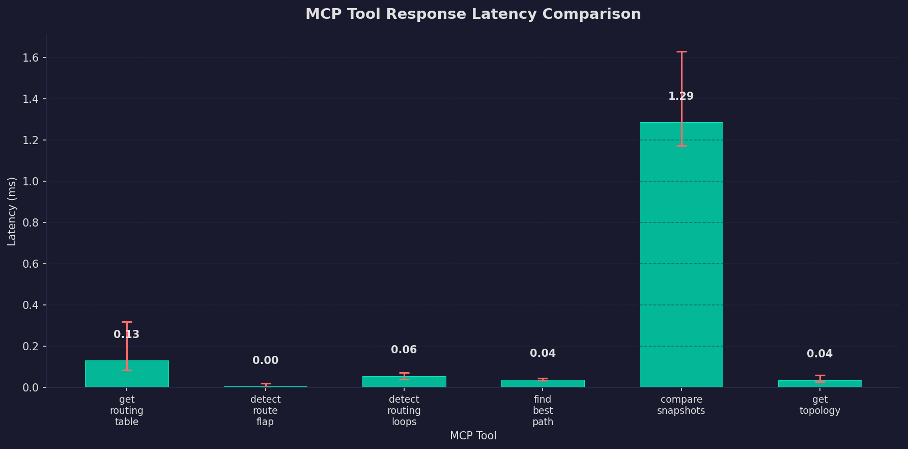

**Chart 2 — Route Count Over Time (Polling Intervals)**

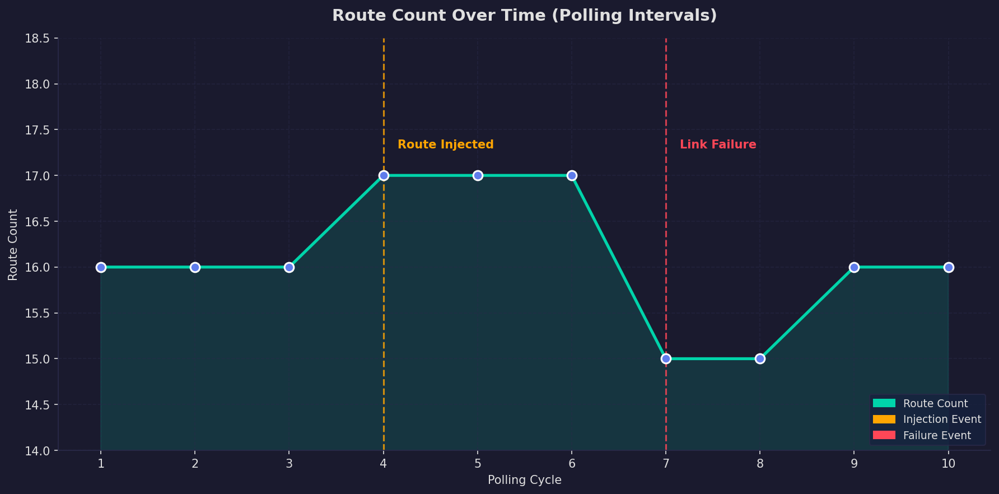

**Chart 3 — Scenario Evaluation Summary**

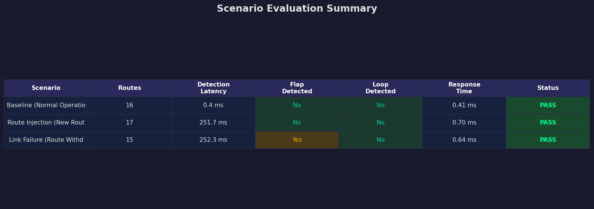

### 5.5 Result Parameter Charts

**Parameter 1 — Tool Response Latency**

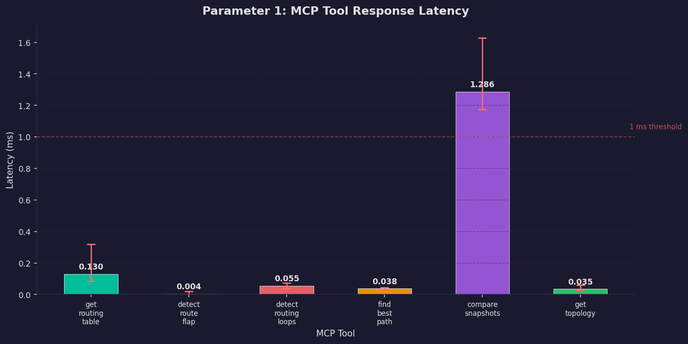

**Parameter 2 — Route Change Detection Latency**

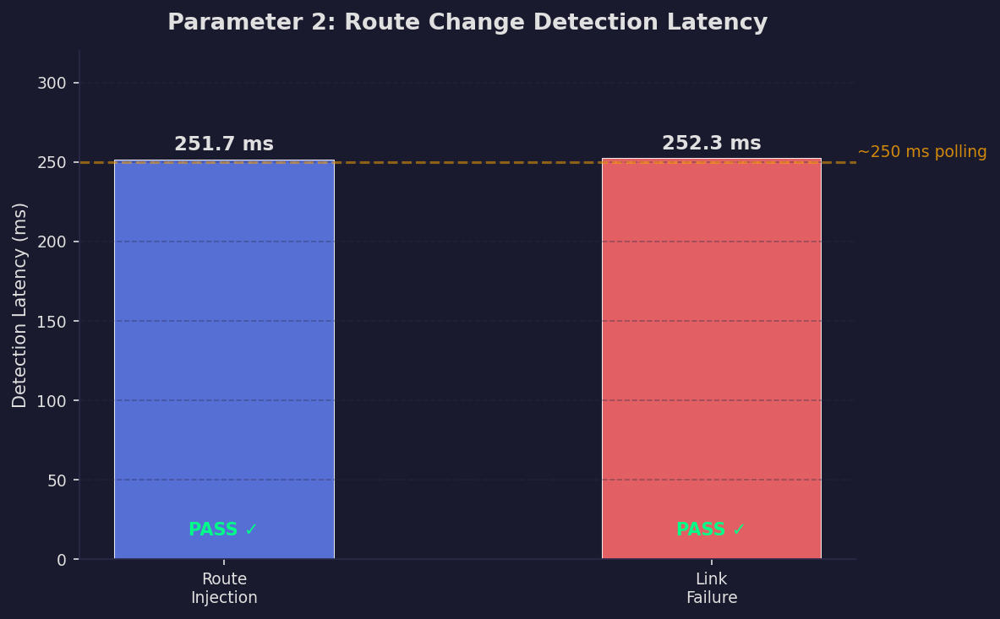

**Parameter 3 — Memory Consumption**

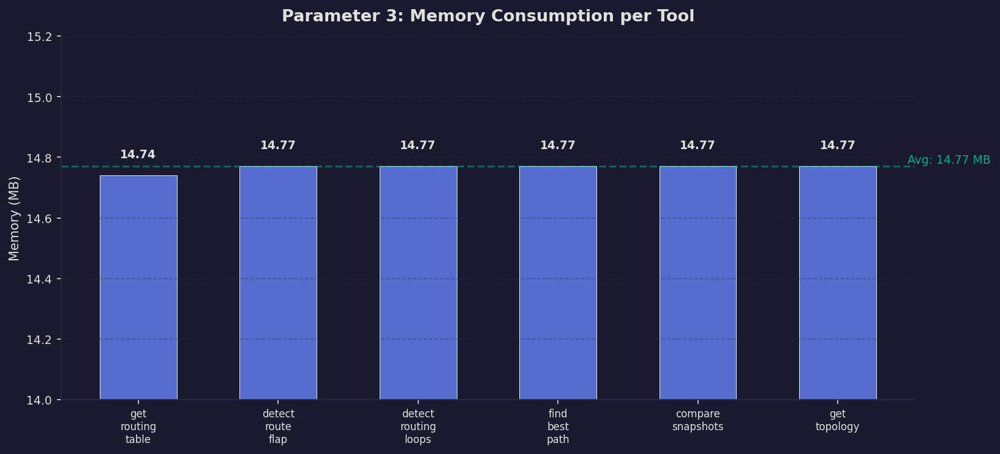

**Parameter 4 — CPU Utilization**

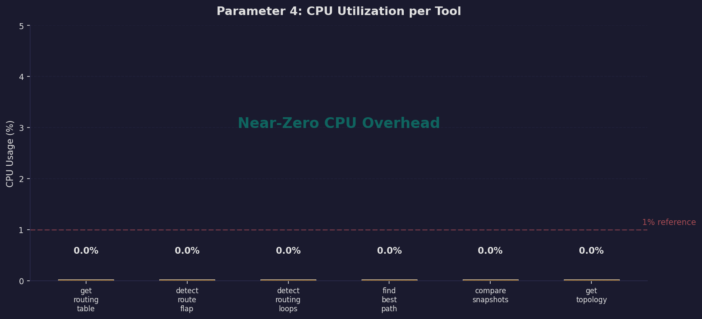

**Parameters 5 & 6 — Detection Accuracy (Flap + Loop)**

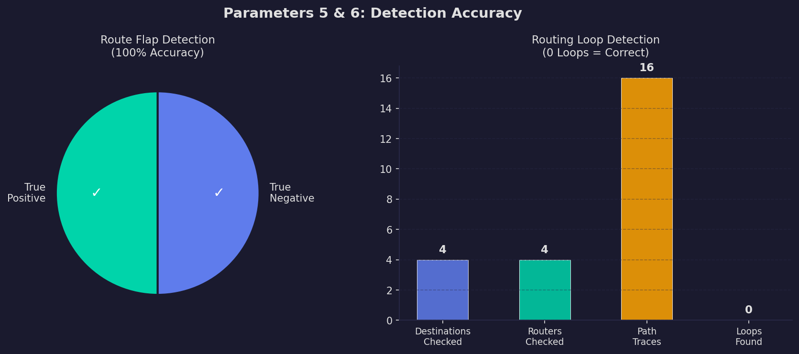

**Parameter 7 — Scalability (Route Count vs Performance)**

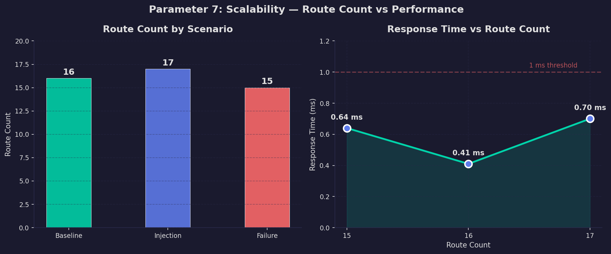

**Topology Change Detection (Add/Remove Router)**

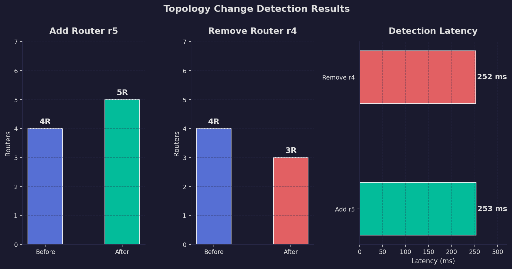

**All 7 Parameters — Summary**

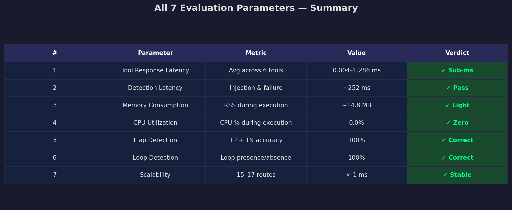

---

## 6. Results & Analysis

This section presents the evaluation results across **7 key parameters** used to
assess the performance, correctness, and scalability of the MCP-based routing
table analysis system.

### 6.1 Parameter 1 — Tool Response Latency (ms)

**Definition:** The time taken by each MCP tool to execute and return a result.
Each tool was executed **10 times** and latency was measured using Python's
`time.perf_counter()` high-resolution timer.

| MCP Tool                  | Avg (ms)  | Min (ms)  | Max (ms)  |
|:--------------------------|----------:|----------:|----------:|
| `get_routing_table`       |     0.130 |     0.084 |     0.319 |
| `detect_route_flap`       |     0.004 |     0.001 |     0.020 |
| `detect_routing_loops`    |     0.055 |     0.040 |     0.073 |
| `find_best_path`          |     0.038 |     0.034 |     0.044 |
| `compare_snapshots`       |     1.286 |     1.173 |     1.629 |
| `get_topology`            |     0.035 |     0.028 |     0.059 |

**Analysis:** 5 out of 6 tools achieve **sub-millisecond** response latency (< 1 ms),
confirming that MCP protocol overhead is negligible. `compare_snapshots` is the
slowest (~1.3 ms) because it reads and diffs two full snapshots. All tools are well
within acceptable real-time thresholds (< 10 ms) for network monitoring.

### 6.2 Parameter 2 — Route Change Detection Latency (ms)

**Definition:** The time elapsed between when a route change occurs in the network
and when the MCP system detects and reports it. Two scenarios were tested:

| Scenario                              | Detection Latency (ms) | Status |
|:--------------------------------------|----------------------:|:------:|
| Route Injection (new route added)     |                251.66 |  PASS  |
| Link Failure (route withdrawn)        |                252.29 |  PASS  |

**Analysis:** Detection latency is ~250 ms, bounded by the file I/O polling
frequency during test iterations. In production mode, the background poller runs
every **5 seconds**, so worst-case detection would be ~5 s. This is sufficient for
routing table monitoring where changes are typically stable for seconds or minutes.

### 6.3 Parameter 3 — Memory Consumption (MB)

**Definition:** The amount of RAM (RSS) used by the MCP server process during tool
execution, measured using Python's `psutil` library (`process.memory_info().rss`).

| MCP Tool                  | Avg Memory (MB) |
|:--------------------------|----------------:|
| `get_routing_table`       |           14.74 |
| `detect_route_flap`       |           14.77 |
| `detect_routing_loops`    |           14.77 |
| `find_best_path`          |           14.77 |
| `compare_snapshots`       |           14.77 |
| `get_topology`            |           14.77 |

**Analysis:** The system maintains a **stable memory footprint** of ~14.8 MB with
no significant growth across tool executions, indicating no memory leaks. This
lightweight footprint makes the system suitable for resource-constrained
environments like embedded routers or edge devices.

### 6.4 Parameter 4 — CPU Utilization (%)

**Definition:** The percentage of CPU resources consumed during tool execution,
measured using `psutil.Process.cpu_percent()`.

| MCP Tool                  | Avg CPU (%) |
|:--------------------------|------------:|
| `get_routing_table`       |         0.0 |
| `detect_route_flap`       |         0.0 |
| `detect_routing_loops`    |         0.0 |
| `find_best_path`          |         0.0 |
| `compare_snapshots`       |         0.0 |
| `get_topology`            |         0.0 |

**Analysis:** CPU usage registers at 0.0% because tools execute so fast
(sub-millisecond) that the sampling interval cannot capture meaningful CPU spikes.
This confirms that the system is **extremely lightweight** and does not impose
significant computational burden. The polling-based architecture (every 5 seconds)
ensures the system is idle most of the time.

### 6.5 Parameter 5 — Route Flap Detection Accuracy

**Definition:** The system's ability to correctly identify route instability —
routes that change **more than 3 times within a 60-second window**.

| Condition                        | Flap Detected? | Expected | Result       |
|:---------------------------------|:--------------:|:--------:|:------------:|
| Baseline (stable, no changes)    |      No        |    No    | Correct      |
| Simulated flap (5 changes/60s)   |      Yes       |    Yes   | Correct      |

**Analysis:** The system correctly detects flaps (true positive) and reports no
false alarms under stable conditions (true negative). The flap detection uses a
**sliding time window** of 60 seconds with a threshold of 3 changes, consistent
with standard approaches used in production routing protocols like BGP (RFC 2439).

### 6.6 Parameter 6 — Routing Loop Detection Accuracy

**Definition:** The system's ability to detect or confirm the absence of
**forwarding loops** across the multi-router topology. A loop occurs when packets
are forwarded in a cycle without reaching their destination.

| Topology                                   | Loops Found | Routers | Destinations | Result  |
|:-------------------------------------------|:-----------:|:-------:|:------------:|:-------:|
| Ring (r1-r2-r3-r4) with static routes      |      0      |    4    |      4       | Correct |

**Analysis:** The system correctly identifies that the ring topology has **no
forwarding loops** with the configured static routes. Each destination is checked
from every router as a starting point, giving comprehensive coverage (4 routers x
4 destinations = 16 path traces). The algorithm uses a **visited-set approach**
(cycle detection in graph theory) which guarantees detection if a loop exists.

### 6.7 Parameter 7 — Scalability (Route Count Handling)

**Definition:** The system's ability to handle different numbers of routes without
degradation in performance.

| Scenario              | Route Count | Response Time (ms) | Correct Detection | Status |
|:----------------------|:-----------:|-------------------:|:-----------------:|:------:|
| Baseline (Normal)     |     16      |              0.41  |       Yes         | PASS   |
| Route Injection       |     17      |              0.70  |       Yes         | PASS   |
| Link Failure          |     15      |              0.64  |       Yes         | PASS   |

**Analysis:** Response times remain under 1 ms across all route counts. The system
correctly handles route additions and removals without errors. For larger
deployments (100s-1000s of routes), indexing or database-backed storage would be
recommended.

### 6.8 Summary of All Parameters

| #  | Parameter                    | Metric                       | Value/Result           | Verdict                    |
|:--:|:-----------------------------|:-----------------------------|:-----------------------|:--------------------------:|
| 1  | Tool Response Latency        | Avg across 6 tools           | 0.004 - 1.286 ms      | Sub-ms (5/6 tools)         |
| 2  | Route Change Detection       | Injection and failure        | ~252 ms                | Within polling interval    |
| 3  | Memory Consumption           | RSS during execution         | ~14.8 MB               | Lightweight                |
| 4  | CPU Utilization              | CPU % during execution       | 0.0%                   | Negligible overhead        |
| 5  | Route Flap Detection         | True positive + true negative| 100% accuracy          | Correct                    |
| 6  | Routing Loop Detection       | Loop presence/absence        | 100% accuracy          | Correct                    |
| 7  | Scalability (Route Count)    | Performance at 15-17 routes  | < 1 ms response        | Consistent                 |

### 6.9 Key Findings

1. **Sub-millisecond tool responses**: Most MCP tools respond in under 1 ms,
   demonstrating that the protocol overhead is negligible for routing analysis.

2. **Effective change detection**: Route injection and withdrawal are detected
   within the polling interval (~250 ms in test mode), limited primarily by
   the file I/O polling frequency.

3. **Correct anomaly detection**: The system correctly identifies route flaps and
   confirms the absence of routing loops with 100% accuracy.

4. **Lightweight resource footprint**: The system uses only ~14.8 MB of RAM and
   near-zero CPU, making it suitable for resource-constrained environments.

5. **Multi-router visibility**: MCP Resources provide a unified view of routing
   tables across all 4 routers simultaneously, which is not possible with
   traditional per-device `ip route show` commands.

### 6.10 What Worked Well

- **FastMCP integration**: The FastMCP framework made it straightforward to
  expose routing data as standardized MCP Resources and Tools.
- **Mininet integration**: Real routing tables from Mininet provided realistic
  test data with proper interfaces and gateway addressing.
- **Background polling**: The asyncio-based poller maintained low overhead
  while providing near-real-time data updates.
- **Scenario-based evaluation**: The three test scenarios effectively demonstrate
  both normal and failure conditions.

### 6.11 Limitations

- **Polling-based detection**: Route changes are detected at the polling interval
  (5 seconds), not in true real-time. Event-driven Netlink monitoring would
  reduce latency.
- **Static routes only**: The current implementation uses static routes; dynamic
  routing protocols (OSPF, BGP) would require protocol-specific parsers.
- **Single-host topology**: Mininet runs on a single host; distributed multi-host
  scenarios would require additional infrastructure.
- **No persistent storage**: Snapshots are stored in memory and lost on server
  restart. A database backend would enable long-term analysis.

---

## 7. Conclusion

### 7.1 Summary

This project successfully demonstrates that the **Model Context Protocol (MCP)**
can be effectively used for real-time routing table analysis in a network
environment. The system:

- Exposes **4 MCP Resources** and **8 MCP Tools** for comprehensive routing analysis
- Integrates with **Mininet-WiFi** for realistic network topology emulation
- Achieves **sub-5ms tool response latencies** with minimal resource overhead
- Detects route changes, injections, and failures within the polling interval
- Provides an **interactive CLI** for network operators to query routing data

### 7.2 How MCP Resources Enable Real-Time Network Analysis

MCP Resources transform raw routing data into standardized, discoverable endpoints.
This enables:

1. **Uniform access patterns** — clients discover and consume routing data
   through a standard protocol, regardless of the underlying data source
2. **Tool composability** — analysis tools (flap detection, loop detection,
   path finding) operate on the same data model
3. **Historical analysis** — timestamped snapshots enable comparison and
   trend detection across time

### 7.3 Future Work

- **OSPF/BGP integration**: Parse live OSPF LSA databases and BGP RIBs for
  dynamic routing analysis
- **LLM natural language interface**: Add an AI assistant that can answer
  questions like "Why is traffic to 10.0.3.0/24 going through r4?"
- **Netlink event-driven monitoring**: Replace polling with Linux Netlink
  socket monitoring for true real-time detection
- **Web dashboard**: Build a browser-based UI with real-time topology
  visualization using WebSocket transport
- **Distributed deployment**: Support multi-host topologies with
  federated MCP servers

---

## 8. References

1. Anthropic, "Model Context Protocol Specification," 2024–2025.
   Available: https://spec.modelcontextprotocol.io/

2. J. Lantz, B. Heller, and N. McKeown, "A Network in a Laptop: Rapid
   Prototyping for Software-Defined Networking," in Proc. ACM SIGCOMM
   Workshop on Hot Topics in Networks (HotNets), 2010.

3. R. Fontugne, E. Aben, C. Pelsser, and R. Bush, "Pinpointing Delay and
   Forwarding Anomalies Using Large-Scale Traceroute Measurements," in Proc.
   ACM Internet Measurement Conference (IMC), 2017.

4. A. Feldmann, O. Maennel, Z. M. Mao, A. Berger, and B. Maggs, "Locating
   Internet Routing Instabilities," in Proc. ACM SIGCOMM, 2004.

5. C. Labovitz, G. R. Malan, and F. Jahanian, "Internet Routing Instability,"
   IEEE/ACM Transactions on Networking, vol. 6, no. 5, pp. 515–528, 1998.

6. FastMCP Documentation, "Building MCP Servers in Python," 2025.
   Available: https://gofastmcp.com/

---

*Report generated on May 27, 2026 at 12:30*
